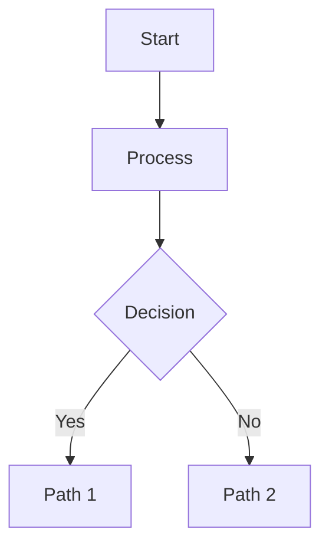
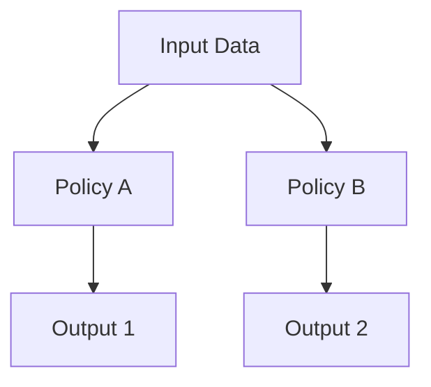
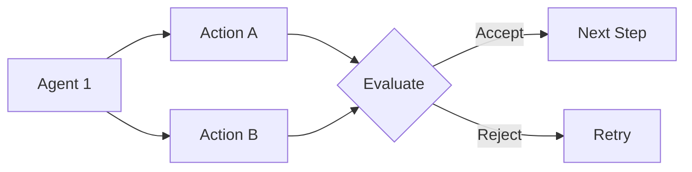
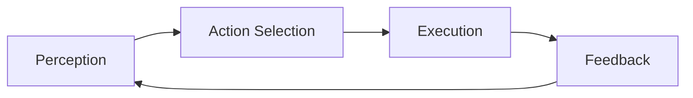

# Architecture Diagrams

## End-to-End Flow

```mermaid
flowchart TD
    A[Start] --> B[Process]
    B --> C{Decision}
    C -->|Yes| D[Path 1]
    C -->|No| E[Path 2]
```

## Solver Policy Selection

```mermaid
flowchart TB
    A[Input Data] --> B[Policy A]
    A --> C[Policy B]
    B --> D[Output 1]
    C --> E[Output 2]
```

## Dual-Pipeline Agent Flow

```mermaid
flowchart LR
    A[Agent 1] --> B[Action A]
    A --> C[Action B]
    B --> D{Evaluate}
    C --> D
    D -->|Accept| E[Next Step]
    D -->|Reject| F[Retry]
```

## Adaptive Agent Loop

```mermaid
flowchart LR
    A[Perception] --> B[Action Selection]
    B --> C[Execution]
    C --> D[Feedback]
    D --> A
```
