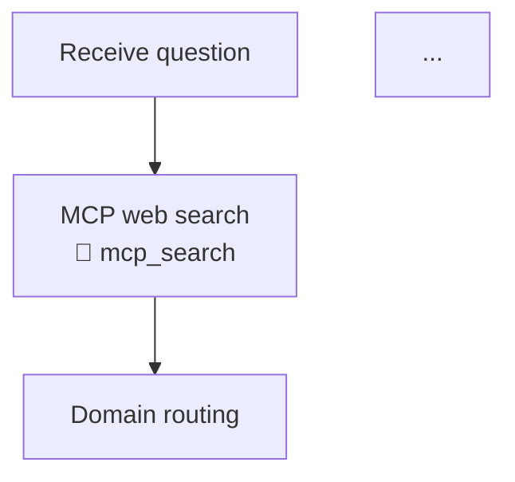

# Human Intuition Scientist

A multi-agent AI system that weighs **human intuition** against **domain-expert AI reasoning** and **MCP/tool-sourced evidence** to produce structured, transparent answers to complex questions.

## Features at a glance

| Feature | Description |
|---|---|
| **24 domain agents** | Science, industry, enterprise, mastery, research, and experiment domains |
| **Dual-pipeline** | Every agent runs an *intuition path* (knowledge only) **and** a *tool/MCP path* (web-grounded), then blends them with intelligent weights |
| **Iterative hard-problem tutors** | Physics and Signal Processing agents select the *hardest applicable problem type* and guide learners step-by-step with checkpoints and targeted hints |
| **Experiment Runner** | Classifies which questions warrant experiments, then generates a structured set of targeted experiments (hypotheses, variables, runnable Python/NumPy snippets) — non-experimentable questions receive direct expert analysis instead |
| **Auto-intuition mode** | `--auto-intuition` skips the interactive prompt and auto-generates a human perspective via keyword heuristics + optional LLM quick-think |
| **Adaptive agent loop** | `--adaptive-agents` starts with 3 agents and expands only when confidence is insufficient, with optional `--target-latency-ms` budget |
| **Debate harness** | Structured multi-party debate: human vs. tool evidence vs. agents |
| **Interview coach** | Socratic FAANG interview prep with 100+ practice problems and hints |
| **Model sweep** | Cycle across any open-source or free-tier model backends; compare results |
| **Free-only models** | Anthropic and OpenAI are disabled; only free/open backends supported |

---

## Table of contents

1. [macOS (Apple Silicon) + Ollama Quickstart](#macos-apple-silicon--ollama-quickstart)
2. [Prerequisites](#prerequisites)
3. [Installation](#installation)
4. [Running the app](#running-the-app)
5. [Supported model backends](#supported-model-backends)
6. [Domain agents](#domain-agents)
7. [Modes of operation](#modes-of-operation)
8. [Running the test suite](#running-the-test-suite)
9. [Model sweep tests](#model-sweep-tests)
10. [Project structure](#project-structure)

---

## macOS (Apple Silicon) + Ollama Quickstart

> Recommended setup for **M1 / M2 / M3 / M4** Macs (tested on M4 Max 48 GB).

```bash
# 1) Install Ollama
curl -fsSL https://ollama.com/install.sh | sh

# 2) Start the server (auto-starts on macOS; safe to run again)
ollama serve

# 3) Pull a recommended model
ollama pull qwen2.5:7b        # fast, great quality/latency balance
# or
ollama pull llama3.1:8b       # slightly stronger, slightly slower

# 4) Clone and set up the repo
git clone https://github.com/skanjila/intuition-scientist.git
cd intuition-scientist
python3 -m venv .venv
source .venv/bin/activate
pip install -r requirements.txt

# 5) Run — fast preset (lowest latency on Apple Silicon)
python main.py --provider ollama:qwen2.5:7b --fast \
  --question "How does attention in transformers relate to adaptive filtering?"

# 6) Keep Ollama warm between runs (avoids reload cost)
export OLLAMA_KEEP_ALIVE=30m
ollama ps   # model should appear in the "running" column
```

**What `--fast` does on Apple Silicon:**

| Setting | `--fast` value | Standard default |
|---|---|---|
| `--max-workers` | **1** | 7 |
| `--max-domains` | **3** | unlimited |
| MCP internet search | **off** | on |
| `--agent-max-tokens` | **256** | 1024 |
| `--synthesis-max-tokens` | **384** | 512 |

Need more quality? Keep `--fast` but allow more agents:

```bash
python main.py --provider ollama:qwen2.5:7b --fast --max-domains 5
```

---

## Prerequisites

| Requirement | Version | Notes |
|---|---|---|
| Python | 3.11 or 3.12 | 3.12 recommended |
| pip | any recent | comes with Python |
| git | any | to clone the repo |
| Ollama *(optional)* | latest | for local open-source models |
| llama.cpp *(optional)* | latest | for GGUF model files |

---

## Installation

```bash
# 1. Clone the repository
git clone https://github.com/skanjila/intuition-scientist.git
cd intuition-scientist

# 2. Create and activate a virtual environment (recommended)
python3 -m venv .venv
source .venv/bin/activate          # macOS / Linux
# .venv\Scripts\activate           # Windows

# 3. Install dependencies
pip install -r requirements.txt

# 4. (Optional) copy the environment template and fill in API keys
cp .env.example .env               # if the file exists
```

No API keys are required to run in **mock mode** (the default).

---

## Running the app

### Fully interactive (mock backend — no model required)

```bash
python main.py
```

You will be prompted for a question and your intuition. The system runs all relevant domain agents using the mock backend (instant, offline, no GPU needed) and returns a `WeighingResult`.

### Provide a question on the command line

```bash
python main.py --question "How does attention in transformers relate to adaptive filtering?"
```

### Use a specific free model backend

```bash
# Ollama (must have Ollama running: https://ollama.com)
python main.py --provider ollama:llama3.1:8b

# llama.cpp (provide path to your GGUF file)
python main.py --provider "llamacpp:models/llama-3.1-8b-instruct-q4_k_m.gguf"

# Groq free-tier (requires GROQ_API_KEY env var)
python main.py --provider groq:llama-3.1-8b-instant

# Together AI free-tier (requires TOGETHER_API_KEY env var)
python main.py --provider together:meta-llama/Llama-3.1-8B-Instruct-Turbo

# Cloudflare Workers AI (requires CF_ACCOUNT_ID and CF_API_TOKEN env vars)
python main.py --provider "cloudflare:@cf/meta/llama-3.1-8b-instruct"

# OpenRouter (requires OPENROUTER_API_KEY env var)
python main.py --provider "openrouter:meta-llama/llama-3.1-8b-instruct:free"
```

### Restrict to specific domains

```bash
# Use domain shortcuts (see full list below)
python main.py --domains physics nn dl

# Signal processing — iterative hard-problem tutor
python main.py --domains signal --question "Design a Wiener filter for noise cancellation"

# Experiment runner — converts question to a structured experiment plan
python main.py --domains experiment --question "Does gradient descent converge faster with momentum?"

# Interview prep coaching
python main.py --domains interview --question "Explain the two-pointer pattern"

# PhD EE/LLM research
python main.py --domains phd --question "How does Mamba relate to IIR filters?"

# FAANG system design
python main.py --domains faang --question "Design a rate limiter"
```

### Disable internet search (MCP)

```bash
python main.py --no-mcp
```

### Agentic workflow visibility (`--workflow-map`)

Append a visual breakdown of the agentic reasoning pipeline to every answer.

```bash
# Default — standard map (Mermaid diagram + inputs & plan)
python main.py --question "How does RLHF work?"

# Deep mode — all sections: diagram, inputs, assumptions, plan,
#   tool-call plan & results, intermediate artifacts, next actions
python main.py --workflow-map deep --question "How does RLHF work?"

# Compact — Mermaid diagram only
python main.py --workflow-map compact --question "How does RLHF work?"

# Off — no workflow section
python main.py --workflow-map off --question "How does RLHF work?"

# --explain-workflow is an alias for --workflow-map deep
python main.py --explain-workflow --question "How does RLHF work?"
```

**Mode comparison:**

| Mode | Mermaid diagram | Inputs & plan | Assumptions | Tool-call details | Intermediate artifacts | Next actions |
|---|:---:|:---:|:---:|:---:|:---:|:---:|
| `off` | — | — | — | — | — | — |
| `compact` | ✅ | — | — | — | — | — |
| `standard` *(default)* | ✅ | ✅ | — | — | — | — |
| `deep` | ✅ | ✅ | ✅ | ✅ | ✅ | ✅ |

**Example deep-mode output (excerpt):**

```
## Workflow (Deep)

### (A) Mermaid workflow diagram



### (B) Inputs & context
- Question: "How does RLHF work?"
- Domains queried: Neural Networks, Deep Learning, ...

### (C) Assumptions
- Human intuition was provided before agent inference (no leakage).
...

### (D) Plan
1. Capture human intuitive answer and confidence.
2. Route question to N relevant domain agent(s).
...

### (E) Tool-call plan & results
- **mcp_search**: Retrieve up-to-date web evidence…
  - Result: Web context retrieved for 3 domain(s)…

### (F) Intermediate artifacts
| Domain | Similarity | Agent Confidence |
|---|---|---|
| Neural Networks | 0.82 | 90% |
...

### (G) Next actions / options
- Try `--domains <domain>` to drill into a specific area.
...
```

### Interview prep mode (three agents: technical + algorithmic + psychological)

```bash
python main.py --mode interview --question "Solve the Trapping Rain Water problem"
```

### Physics / Signal Processing iterative tutor mode

Both the `physics` and `signal` / `dsp` agents implement an **iterative
hard-problem protocol**:

1. The agent asks for your intuitive approach before revealing anything.
2. It selects the *hardest applicable problem type* from its internal catalog
   (10 categories ordered from hardest to easiest).
3. The solution is structured as numbered **checkpoints** — the agent pauses
   after each one so you can attempt the next step.
4. Stuck? Ask for a hint; you receive the *minimum* nudge needed to proceed.
5. After each major result the agent compares it to your initial intuition.

```bash
# Physics iterative tutor
python main.py --domains physics --question "Derive the path integral for a harmonic oscillator"

# Signal processing iterative tutor
python main.py --domains signal --question "Design an optimal Wiener filter for speech enhancement"
```

### Experiment Runner mode

The `experiment` / `simulate` agent first **classifies** whether a question
can be meaningfully answered through lightweight computational experiments,
then generates a structured set of targeted experiment specs for qualifying
questions.

#### Question classification

The classifier scores questions on a continuous ``[-1.0, +1.0]`` scale using
deterministic rule-based heuristics — no LLM required:

| Signal | Δ score | Examples |
|---|---|---|
| Quantitative language | +0.30 | "how does X scale with Y", "what percentage" |
| Causal relationship | +0.25 | "what effect does X have on Y", "does X cause Y" |
| Probabilistic / stochastic | +0.25 | "probability of", "expected value", "Monte Carlo" |
| Hypothesis-bearing | +0.25 | "is it true that", "prove that", "will X converge" |
| Experiment verb | +0.20 | "simulate", "model", "benchmark", "test" |
| Optimisation | +0.20 | "minimise", "find the optimal value of X" |
| Comparative with metric | +0.20 | "which is faster in terms of Z" |
| Pure definition | −0.40 | "what is the definition of", "define" |
| Historical fact | −0.30 | "when was", "who invented" |
| Recommendation only | −0.15 | "should I use", "which framework is best" |

Questions with net score ≥ 0.15 receive a full experiment plan.

#### Experiment types

For qualifying questions the agent selects the best-fit experiment type(s):

| Type | Use case |
|---|---|
| **Numeric sweep** | Vary one parameter, observe output trend |
| **Monte Carlo** | Probabilistic claims, expected-value estimation |
| **Toy analytical** | Exact small-system solution to test a hypothesis |
| **Dimensional / scaling** | Derive the expected scaling law |
| **Finite-difference** | Integrate an ODE/PDE numerically |
| **Combinatorial** | Enumerate all small cases (N ≤ 20) |
| **Perturbation / sensitivity** | Rank inputs by ∂output/∂input |
| **Fermi estimate** | Order-of-magnitude bound before detailed calculation |

#### Usage

```bash
# The agent classifies the question first — this one is experimentable
# (causal + quantitative signals) and produces a numeric sweep + perturbation spec.
python main.py --domains experiment \
  --question "Does gradient descent converge faster with momentum on a quadratic loss?"

# Auto-intuition + experiment agent: fully non-interactive pipeline
python main.py --domains experiment --auto-intuition \
  --question "How does the learning rate affect the convergence speed?"

# Adaptive loop: starts with 3 agents, expands to include experiment domain if needed
python main.py --adaptive-agents --auto-intuition \
  --question "How does L2 regularisation affect generalisation error?"

# Non-experimentable question — agent returns direct expert analysis, no plan
python main.py --domains experiment \
  --question "What is the definition of backpropagation?"
```

#### plan_experiments() API

```python
from src.agents.experiment_runner_agent import ExperimentRunnerAgent
from src.models import ExperimentPlan

agent = ExperimentRunnerAgent()

# Classify first (no LLM needed)
experimentability = ExperimentRunnerAgent.classify_question(
    "How does learning rate affect convergence speed?"
)
print(experimentability.is_experimentable)  # True
print(experimentability.question_type)       # "quantitative-causal"
print(experimentability.score)               # e.g. 0.55

# Generate structured experiment plan (uses LLM if available, otherwise templates)
plan: ExperimentPlan = agent.plan_experiments(
    "How does learning rate affect convergence speed?"
)
for spec in plan.experiments:
    print(spec.id, spec.category.value, spec.hypothesis)
    print(spec.python_snippet)
```

---

## Non-interactive and adaptive modes (`--auto-intuition`, `--adaptive-agents`)

### `--auto-intuition` — skip the human prompt

By default the CLI pauses and prompts you for your intuitive answer before
querying any agents.  `--auto-intuition` bypasses this entirely: the system
synthesises a plausible non-expert perspective automatically using keyword
heuristics + an optional short LLM "quick-think" pass.

```bash
# Fully non-interactive — no stdin required
python main.py --question "How does RLHF work?" --auto-intuition --no-mcp

# Works with --question or interactive question entry
python main.py --auto-intuition --no-mcp
# (you are only asked for the question, never for your intuition)
```

The auto-generated intuition uses **moderate confidence (0.5)** — it is
treated as a plausible but uncertain human estimate rather than a carefully
considered judgment.  All downstream analysis (weighing, synthesis, accuracy
scoring) behaves identically to the interactive path.

### `--adaptive-agents` — intelligent expanding agent loop

Instead of querying a fixed set of domain agents, the adaptive loop:

1. Starts with the **3 most relevant domains** (ranked by keyword matching).
2. Queries them in parallel.
3. Computes mean agent confidence across responses.
4. If mean confidence ≥ 0.65 → **stop** (coverage is sufficient).
5. Otherwise adds the next 2 highest-ranked domains and repeats.

Stopping criteria (any one halts expansion):
- Mean confidence ≥ 0.65
- No remaining candidate domains
- `--max-domains` ceiling reached
- Wall-clock budget exceeded (`--target-latency-ms`)

```bash
# Adaptive loop — expands domains only if initial agents are uncertain
python main.py --question "Explain the bias-variance tradeoff" \
  --auto-intuition --adaptive-agents --no-mcp

# With time budget: stop expanding after 5 seconds regardless of confidence
python main.py --question "How does attention work in transformers?" \
  --auto-intuition --adaptive-agents --target-latency-ms 5000 --no-mcp

# Combine with --max-domains to cap the absolute maximum
python main.py --question "How does quantum computing differ from classical?" \
  --auto-intuition --adaptive-agents --max-domains 6 --no-mcp
```

### MCP interaction

| Flags | MCP behaviour |
|---|---|
| *(default)* | MCP enabled |
| `--no-mcp` | MCP disabled |
| `--use-mcp` | MCP explicitly forced on (overrides `--fast` preset) |
| `--auto-intuition` + *(default)* | MCP still enabled for agents |
| `--auto-intuition --no-mcp` | No MCP, no interactive prompt — fastest mode |

### New CLI flags summary

| Flag | Type | Description |
|---|---|---|
| `--auto-intuition` | flag | Skip interactive prompt; auto-generate human perspective |
| `--adaptive-agents` | flag | Enable evolving agent-selection loop |
| `--target-latency-ms MS` | integer | Wall-clock budget for adaptive loop (ms) |

---

## Low latency on Mac (Ollama)

If you are running **Ollama on Apple Silicon** (M1/M2/M3/M4), use the `--fast`
preset to get the shortest time-to-answer with reasonable quality.

### Why answers can feel slow by default

The orchestrator normally runs up to 7 agent LLM calls **plus** synthesis and
analysis calls (each up to 1,024 tokens).  On a single local GPU, many
concurrent generations compete for the same compute, which often *increases*
end-to-end latency compared with running them one at a time.

### Recommended command (`--fast` preset)

```bash
python main.py --provider ollama:qwen2.5:7b --fast \
  --question "How does attention in transformers relate to adaptive filtering?"
```

`--fast` applies these defaults (each can be overridden individually):

| Setting | Fast preset | Standard default |
|---|---|---|
| `--max-workers` | **1** | 7 |
| `--max-domains` | **3** | unlimited |
| MCP internet search | **off** | on |
| `--agent-max-tokens` | **256** | 1024 |
| `--synthesis-max-tokens` | **384** | 512 |

### Override individual settings

```bash
# Fast preset but re-enable MCP web search
python main.py --provider ollama:qwen2.5:7b --fast --use-mcp

# Fast preset with more agents (higher quality, slower)
python main.py --provider ollama:qwen2.5:7b --fast --max-domains 5

# Explicit workers and token caps without the full preset
python main.py --provider ollama:qwen2.5:7b --max-workers 2 \
  --agent-max-tokens 512 --synthesis-max-tokens 512 --no-mcp
```

### Quick performance diagnostic

Run the same question twice to confirm the bottleneck:

```bash
# Fast settings (~3× speedup on a typical M4 Max)
time python main.py --provider ollama:qwen2.5:7b --fast \
  --question "Explain gradient descent"

# Standard defaults
time python main.py --provider ollama:qwen2.5:7b \
  --question "Explain gradient descent"
```

If `--fast` is dramatically quicker, the bottleneck is **too many agents /
too much concurrency / too many tokens** rather than raw GPU throughput.

### Keeping Ollama warm

Make sure your model stays loaded between questions to avoid repeated warm-up
costs.  In a separate terminal:

```bash
ollama ps   # should show your model in the "running" column
```

If the model is not listed, it will be reloaded on every question — add
`OLLAMA_KEEP_ALIVE=30m` to your environment to keep it resident.

---

## Supported model backends

> **Note:** Anthropic (`claude-*`) and OpenAI (`gpt-*`) are intentionally **not supported**. Only free and open-source providers are allowed.

### Local backends (always free)

| Backend | Spec format | Setup |
|---|---|---|
| **Mock** | `mock` | Built-in, no setup needed, fully offline |
| **Ollama** | `ollama:<model>` | Install [Ollama](https://ollama.com), run `ollama pull llama3.1:8b` |
| **llama.cpp** | `llamacpp:<path/to/model.gguf>` | Build [llama.cpp](https://github.com/ggerganov/llama.cpp), download a GGUF |

#### Ollama quick start

```bash
# Install Ollama (macOS/Linux)
curl -fsSL https://ollama.com/install.sh | sh

# Pull a model
ollama pull llama3.1:8b
ollama pull qwen2.5:7b

# Start the server (it auto-starts on macOS)
ollama serve

# Run the app
python main.py --provider ollama:llama3.1:8b
```

#### llama.cpp quick start

```bash
# Build llama.cpp
git clone https://github.com/ggerganov/llama.cpp
cd llama.cpp && make -j

# Download a GGUF model (example: from HuggingFace)
# Place it in intuition-scientist/models/

# Run the app (from repo root)
python main.py --provider "llamacpp:models/llama-3.1-8b-instruct-q4_k_m.gguf"
```

### Hosted free-tier backends (require env vars)

| Backend | Spec format | Required env var(s) |
|---|---|---|
| **Groq** | `groq:<model>` | `GROQ_API_KEY` — [console.groq.com](https://console.groq.com) |
| **Together AI** | `together:<model>` | `TOGETHER_API_KEY` — [api.together.ai](https://api.together.ai) |
| **Cloudflare Workers AI** | `cloudflare:<model>` | `CF_ACCOUNT_ID` + `CF_API_TOKEN` |
| **OpenRouter** | `openrouter:<model>` | `OPENROUTER_API_KEY` — [openrouter.ai](https://openrouter.ai) |

Set env vars in your shell or in a `.env` file:

```bash
export GROQ_API_KEY=gsk_...
export TOGETHER_API_KEY=...
export CF_ACCOUNT_ID=...
export CF_API_TOKEN=...
export OPENROUTER_API_KEY=sk-or-...
```

### Recommended starter model list

```bash
export INTUITION_SCIENTIST_MODELS="\
ollama:llama3.1:8b,\
ollama:qwen2.5:7b,\
llamacpp:models/llama-3.1-8b-instruct-q4_k_m.gguf,\
groq:llama-3.1-8b-instant,\
together:meta-llama/Llama-3.1-8B-Instruct-Turbo,\
cloudflare:@cf/meta/llama-3.1-8b-instruct,\
openrouter:meta-llama/llama-3.1-8b-instruct:free"
```

---

## Domain agents

The system has **24 domain agents** in four groups:

### Core science & engineering

| Domain | Shortcut | Description |
|---|---|---|
| Electrical Engineering | `ee` | Circuits, signals, power, control systems |
| Computer Science | `cs` | Algorithms, complexity, software systems |
| Neural Networks | `nn` | Deep theory, signal processing connections, next-gen architectures |
| Social Science | `social` | Behaviour, psychology, sociology, game theory |
| Space Science | `space` | Astrophysics + 7 planetary exploration scenarios |
| Physics | `physics` | Quantum, relativity, condensed matter, statistical mechanics — iterative hard-problem tutor |
| Deep Learning | `dl` | Transformers, SSMs, diffusion, scaling, alignment |
| Signal Processing | `signal` / `dsp` | Filter design, spectral estimation, adaptive filters — iterative hard-problem tutor |

### High-economic-value industry

| Domain | Shortcut | Description |
|---|---|---|
| Healthcare | `healthcare` | Drug discovery, diagnostics, clinical trials |
| Climate & Energy | `climate` | Renewables, grid, decarbonisation, tipping points |
| Finance & Economics | `finance` | Quant finance, risk, macro economics |
| Cybersecurity | `cyber` | Threat analysis, adversarial ML, cryptography |
| Biotech & Genomics | `biotech` | CRISPR, protein folding, synthetic biology |
| Supply Chain | `supply_chain` | Logistics, resilience, demand forecasting |

### Enterprise problems

| Domain | Shortcut | Description |
|---|---|---|
| Legal & Compliance | `legal` | Contract law, GDPR, IP, regulatory risk |
| Enterprise Architecture | `architecture` | Cloud, microservices, technical debt |
| Marketing & Growth | `marketing` | Attribution, CLV, PLG, A/B testing |
| Organisational Behaviour | `org` | Talent, culture, leadership, workforce planning |
| Strategy & Intelligence | `strategy` | Competitive moats, M&A, scenario planning |

### Mastery, interview, research, and experiments

| Domain | Shortcut | Description |
|---|---|---|
| Algorithms & Programming | `algo` | Python, Rust, Go; all DS&A patterns |
| Interview Prep | `interview` / `faang` | 100+ LeetCode patterns + system design + STAR coaching |
| EE LLM Research | `phd` / `ee_llm` | LLMs, signal processing, LLM safety — PhD-level advisor |
| Experiment Runner | `experiment` / `simulate` | Classifies questions by experimentability, then generates targeted experiment specs (numeric sweep, Monte Carlo, sensitivity analysis, etc.) with runnable Python/NumPy snippets |

---

## Modes of operation

### Standard mode (default)
Weighs human intuition against domain agents using the dual-pipeline.
```bash
python main.py --mode run
```

### Debate mode
Runs a structured debate: human intuition vs. MCP/web tool evidence vs. agents.
Each round surfaces agreements and disagreements explicitly.
```bash
python main.py --mode debate --question "Is microservices the right default architecture?"
```

### Interview prep mode
Routes through `InterviewPrepAgent` (technical) + `AlgorithmsProgrammingAgent` (algo depth) + `SocialScienceAgent` (mental preparation). Returns scored `InterviewResult`.
```bash
python main.py --mode interview --question "How do you find the kth largest element?"
```

---

## Running the test suite

```bash
# Run all tests (offline, no model required)
python -m pytest tests/ -v

# Run a specific test file
python -m pytest tests/test_large_suite.py -v

# Run only the dual-pipeline weight tests
python -m pytest tests/test_large_suite.py::TestDualPipelineWeights -v

# Run with coverage
pip install pytest-cov
python -m pytest tests/ --cov=src --cov-report=term-missing
```

Expected output: **436 passed, 37 skipped** (sweep tests skip in CI).

---

## Model sweep tests

Model sweep tests cycle through real backends and compare results across models.
They are **disabled by default** to keep CI fast and free.

### Enable sweep tests

```bash
# Use only the mock backend (always passes, no model needed)
RUN_MODEL_SWEEP=1 python -m pytest tests/test_large_suite.py -v

# Use real models (Ollama must be running with models pulled)
RUN_MODEL_SWEEP=1 \
INTUITION_SCIENTIST_MODELS="ollama:llama3.1:8b,ollama:qwen2.5:7b" \
python -m pytest tests/test_large_suite.py -v

# Full sweep with all providers
RUN_MODEL_SWEEP=1 \
INTUITION_SCIENTIST_MODELS="ollama:llama3.1:8b,groq:llama-3.1-8b-instant,together:meta-llama/Llama-3.1-8B-Instruct-Turbo" \
GROQ_API_KEY=your_key \
TOGETHER_API_KEY=your_key \
python -m pytest tests/test_model_sweep.py tests/test_large_suite.py -v
```

The sweep tests are parametrised: each model × each domain × each mode (run / debate / evaluate_models) runs as a separate test case. Missing backends are skipped gracefully — they never fail the suite.

---

## Project structure

```
intuition-scientist/
├── main.py                          # CLI entry point
├── requirements.txt
├── src/
│   ├── agents/
│   │   ├── base_agent.py            # Dual-pipeline base (intuition + MCP weights)
│   │   ├── algorithms_programming_agent.py
│   │   ├── biotech_genomics_agent.py
│   │   ├── climate_energy_agent.py
│   │   ├── computer_science_agent.py
│   │   ├── cybersecurity_agent.py
│   │   ├── deep_learning_agent.py   # Cutting-edge DL + next-gen architectures
│   │   ├── ee_llm_research_agent.py # PhD: LLMs + signal processing + safety
│   │   ├── electrical_engineering_agent.py
│   │   ├── enterprise_architecture_agent.py
│   │   ├── experiment_runner_agent.py  # NEW: experiment plans + runnable snippets
│   │   ├── finance_economics_agent.py
│   │   ├── healthcare_agent.py
│   │   ├── interview_prep_agent.py  # 100+ DS&A practice problems + system design
│   │   ├── legal_compliance_agent.py
│   │   ├── marketing_growth_agent.py
│   │   ├── neural_networks_agent.py # Deep theory + signal processing + next-gen
│   │   ├── organizational_behavior_agent.py
│   │   ├── physics_agent.py         # Iterative hard-problem tutor (10 problem types)
│   │   ├── signal_processing_agent.py  # NEW: iterative hard-problem tutor (10 types)
│   │   ├── social_science_agent.py
│   │   ├── space_science_agent.py   # + 7 planetary exploration scenarios
│   │   ├── strategy_intelligence_agent.py
│   │   └── supply_chain_agent.py
│   ├── analysis/
│   │   ├── debate_engine.py         # Multi-party debate harness
│   │   └── weighing_system.py       # Human intuition vs. agent weighing
│   ├── intuition/
│   │   └── human_intuition.py       # Capture + domain inference
│   ├── llm/
│   │   ├── base.py                  # LLMBackend protocol
│   │   ├── registry.py              # Free-only provider registry
│   │   ├── mock_backend.py          # Offline CI backend
│   │   ├── ollama_backend.py        # Local Ollama
│   │   ├── llamacpp_backend.py      # Local llama.cpp
│   │   ├── groq_backend.py          # Groq free-tier
│   │   ├── together_backend.py      # Together AI free-tier
│   │   ├── cloudflare_backend.py    # Cloudflare Workers AI
│   │   └── openrouter_backend.py    # OpenRouter
│   ├── mcp/
│   │   └── mcp_client.py            # DuckDuckGo web search (zero-auth)
│   ├── models.py                    # All dataclasses (WeighingResult, DebateResult, …)
│   └── orchestrator/
│       └── agent_orchestrator.py    # run() / debate() / interview_prep() / evaluate_models()
└── tests/
    ├── fixtures/
    │   └── qa.yaml                  # Complex Q&A with human intuition prefills
    ├── test_agents.py
    ├── test_large_suite.py          # 200+ tests across all domains
    ├── test_llm_registry.py
    ├── test_model_sweep.py          # Opt-in: RUN_MODEL_SWEEP=1
    ├── test_models.py
    ├── test_new_agents.py           # NEW: tests for signal processing + experiment runner
    ├── test_orchestrator.py
    └── test_weighing.py
```

---

## Environment variable reference

| Variable | Default | Description |
|---|---|---|
| `RUN_MODEL_SWEEP` | *(unset)* | Set to `1` to enable model sweep tests |
| `INTUITION_SCIENTIST_MODELS` | `mock` | Comma-separated model spec list for sweep tests |
| `GROQ_API_KEY` | *(unset)* | Groq API key (free at console.groq.com) |
| `TOGETHER_API_KEY` | *(unset)* | Together AI API key |
| `CF_ACCOUNT_ID` | *(unset)* | Cloudflare account ID |
| `CF_API_TOKEN` | *(unset)* | Cloudflare API token |
| `OPENROUTER_API_KEY` | *(unset)* | OpenRouter API key |

---

## Dual-pipeline weight blending

Each agent computes a pair of weights `(intuition_weight, tool_weight)` that sum to 1.0:

```
base_intuition  ←  domain type (interpretive domains: 0.65; empirical: 0.40; balanced: 0.55)
tool_boost      ←  MCP result quality × 0.20   (more evidence → higher tool weight)
type_modifier   ←  ±0.10 (factual "what/when" → +tool; analytical "why/how" → +intuition)

tool_weight     = clamp(base_tool + tool_boost + type_modifier, 0.10, 0.75)
intuition_weight = 1.0 - tool_weight
```

Both paths always run. The dominant path provides the main answer text; the minority path adds a bracketed insight. The `AgentResponse` records both weights for full transparency.

---

*Anthropic and OpenAI are intentionally not supported. This project is free-only.*
