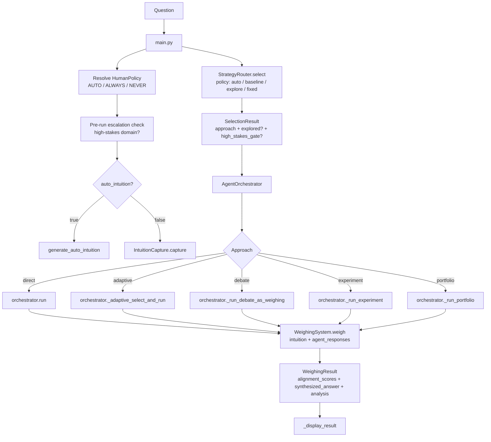
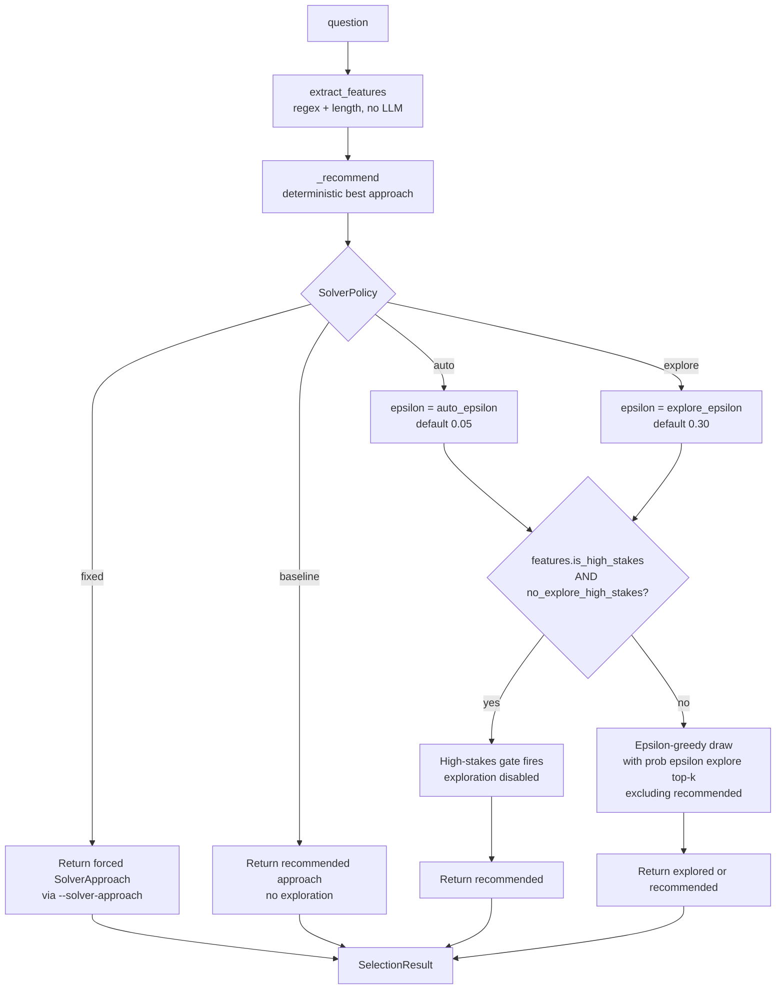
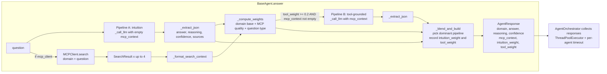
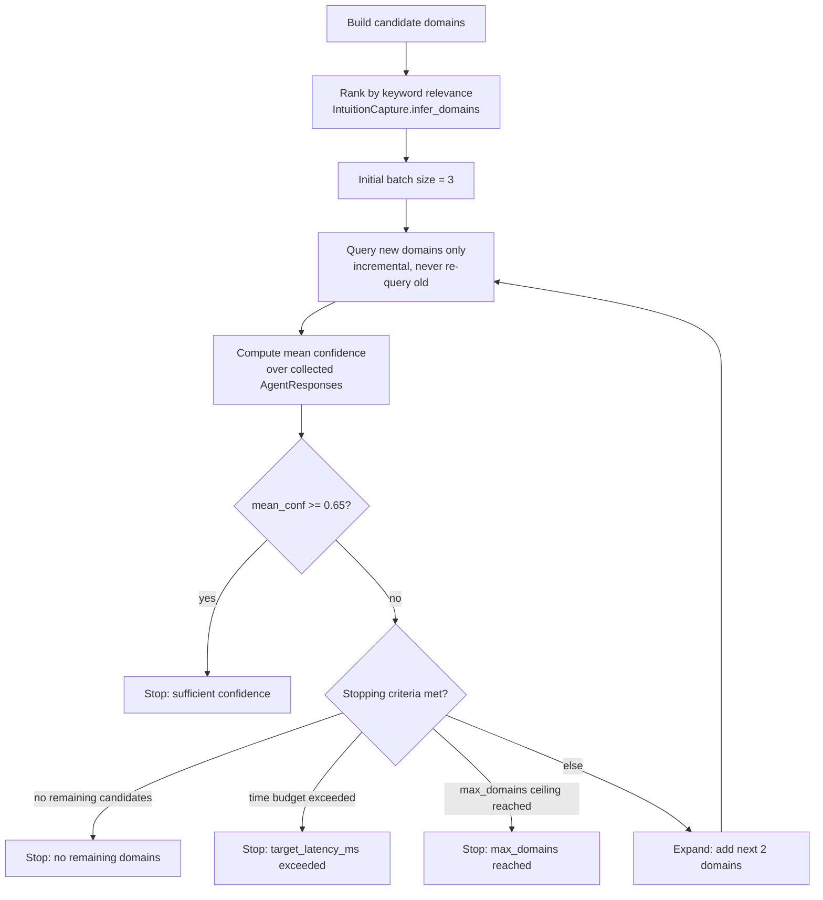

# Intuition Scientist

A multi-agent AI system that weighs **human intuition** against **domain-expert AI reasoning** and **MCP/tool-sourced evidence** to produce structured, transparent answers to complex questions.

---

## Table of contents

1. [Architecture at a glance](#architecture-at-a-glance)
2. [Architecture diagrams](#architecture-diagrams)
   - [End-to-end flow](#end-to-end-flow)
   - [Solver policy selection](#solver-policy-selection)
   - [Dual-pipeline agent flow](#dual-pipeline-agent-flow)
   - [Adaptive agent loop](#adaptive-agent-loop)
3. [Quick start](#quick-start)
4. [CLI flags reference](#cli-flags-reference)
5. [Supported backends](#supported-backends)
6. [Further reading](#further-reading)

---

## Architecture at a glance

```
Question (CLI)
  └─► HumanPolicy → IntuitionCapture (or auto-generate)
  └─► StrategyRouter.select() → SelectionResult (approach + explored? + high_stakes_gate?)
        └─► AgentOrchestrator (direct / adaptive / debate / experiment / portfolio)
              └─► Domain Agents × N  [ThreadPoolExecutor, per-agent timeout]
                    └─► Pipeline A: LLM-only intuition answer
                    └─► Pipeline B: LLM + MCP evidence  (optional)
                    └─► _blend_and_build() → AgentResponse
              └─► WeighingSystem.weigh(intuition, agent_responses)
                    └─► WeighingResult (alignment_scores + synthesized_answer + analysis)
```

Key components and their source locations:

| Component | Source |
|---|---|
| CLI entry point | `main.py` |
| Human policy resolution | `src/intuition/human_policy.py` |
| Intuition capture / auto-generate | `src/intuition/human_intuition.py` |
| Strategy router + feature extraction | `src/solver/router.py` |
| Solver policies and approaches | `src/solver/policy.py` |
| Agent orchestrator (all run modes) | `src/orchestrator/agent_orchestrator.py` |
| Base agent + dual pipeline + weights | `src/agents/base_agent.py` |
| MCP web-search client | `src/mcp/mcp_client.py` |
| Weighing system (alignment + synthesis) | `src/analysis/weighing_system.py` |
| Shared data models | `src/models.py` |

---

## Architecture diagrams

Canonical Mermaid source files are in [`docs/diagrams/`](docs/diagrams/).

### End-to-end flow

Source: [`docs/diagrams/end_to_end_flow.md`](docs/diagrams/end_to_end_flow.md)



### Solver policy selection

Source: [`docs/diagrams/solver_policy_selection.md`](docs/diagrams/solver_policy_selection.md)



### Dual-pipeline agent flow

Source: [`docs/diagrams/dual_pipeline_agent_flow.md`](docs/diagrams/dual_pipeline_agent_flow.md)



### Adaptive agent loop

Source: [`docs/diagrams/adaptive_agent_loop.md`](docs/diagrams/adaptive_agent_loop.md)



---

## Quick start

```bash
# Non-interactive (auto-intuition, mock backend — no API keys needed)
python main.py

# Supply your own question
python main.py --question "How does gradient descent converge?"

# Interactive: system prompts you for your own intuition first
python main.py --interactive --question "..."

# Use a local Ollama model
python main.py --provider ollama:llama3.1:8b --question "..."

# Use Groq free-tier
python main.py --provider groq:llama-3.1-8b-instant --question "..."

# Restrict to specific domains
python main.py --domains physics cs --question "..."

# Adaptive domain expansion (expand-until-confident loop)
python main.py --adaptive-agents --question "..."

# Disable internet search
python main.py --no-mcp --question "..."
```

---

## CLI flags reference

| Flag | Default | Description |
|---|---|---|
| `--question TEXT` | interactive prompt | Question to answer |
| `--human-policy always\|auto\|never` | `auto` | When to prompt for human intuition |
| `--interactive` / `--non-interactive` | non-interactive | Aliases for `--human-policy always/never` |
| `--auto-intuition` | — | Legacy alias for `--non-interactive` |
| `--provider BACKEND` | `mock` | LLM backend (see below) |
| `--domains DOMAIN …` | all domains | Restrict to named domains |
| `--adaptive-agents` | off | Enable adaptive expansion loop |
| `--no-mcp` | MCP on | Disable web-search evidence |
| `--solver-policy auto\|baseline\|explore\|fixed` | `auto` | Strategy-router policy |
| `--solver-approach direct\|adaptive\|debate\|experiment\|portfolio` | — | Force a specific approach (requires `--solver-policy fixed`) |
| `--explore-epsilon FLOAT` | `0.30` | ε for `explore` policy |
| `--no-explore-high-stakes` / `--explore-high-stakes` | gate on | Toggle high-stakes exploration gate |
| `--max-workers INT` | 4 | Thread-pool size for parallel agents |
| `--agent-timeout-seconds FLOAT` | 30 | Per-agent wall-clock timeout |
| `--fast` | off | Low-latency preset |
| `--verbose` / `--quiet` | normal | Output verbosity |

---

## Supported backends

| Backend | Flag | Notes |
|---|---|---|
| Mock (offline) | `mock` | Default; no API key, no network |
| Ollama | `ollama:MODEL` | Local; e.g. `ollama:llama3.1:8b` |
| llama.cpp | `llamacpp:PATH` | Local GGUF model |
| Groq | `groq:MODEL` | Free tier available |
| Together AI | `together:MODEL` | Free tier available |
| Cloudflare AI | `cloudflare:MODEL` | Free tier available |
| OpenRouter | `openrouter:MODEL` | Free tier available |

Anthropic and OpenAI are **not** supported (paid/proprietary).

---

## Further reading

- [`SCENARIOS.md`](SCENARIOS.md) — walkthrough of every supported run mode with example output
- [`RUNNING_TESTS.md`](RUNNING_TESTS.md) — how to run the full offline test suite
- [`docs/AGENT_WORKFLOWS.md`](docs/AGENT_WORKFLOWS.md) — per-agent workflow guide, dual-pipeline tuning, and how to add a new agent
- [`docs/ORCHESTRATOR_WORKFLOWS.md`](docs/ORCHESTRATOR_WORKFLOWS.md) — orchestrator run-mode details (debate, experiment, portfolio, adaptive)
