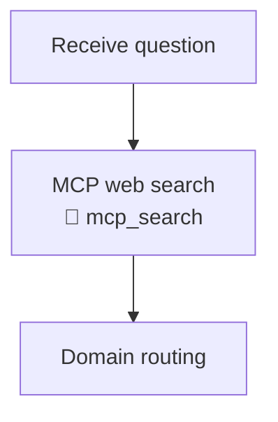

# Scenarios and Expected Output

A step-by-step walkthrough of every supported run mode. Each section shows the exact command, what happens internally, and what to expect in the terminal.

---

## Table of contents

1. [Quickstart (non-interactive)](#quickstart-non-interactive)
2. [Interactive mode](#interactive-mode)
3. [Human involvement policy](#human-involvement-policy)
4. [Verbosity control](#verbosity-control)
5. [Adaptive agent loop](#adaptive-agent-loop)
6. [Domain-specific scenarios](#domain-specific-scenarios)
7. [Workflow map modes](#workflow-map-modes)
8. [Model backends](#model-backends)
9. [Apple Silicon / Ollama fast preset](#apple-silicon--ollama-fast-preset)
10. [CI / scripting](#ci--scripting)
11. [Debate mode](#debate-mode)
12. [Interview prep mode](#interview-prep-mode)
13. [Experiment Runner mode](#experiment-runner-mode)
14. [Physics and Signal Processing iterative tutor](#physics-and-signal-processing-iterative-tutor)
15. [MCP internet search](#mcp-internet-search)
16. [Flag reference](#flag-reference)

---

## Quickstart (non-interactive)

The default mode requires **no stdin** — the system auto-generates a human perspective and immediately queries domain agents.

```bash
python main.py --question "What is 2+2?"
```

**What happens:**
1. Human perspective auto-generated (keyword heuristics + mock LLM quick-think).
2. Relevant domain agents selected (e.g. Mathematics → Computer Science, Physics, …).
3. Per-agent progress printed as each agent finishes.
4. Full `WeighingResult` printed.

**Expected output (excerpt):**

```
🤖  Auto-intuition mode: generating human perspective automatically…

⏳  Querying domain experts…

🔍  MCP internet search: enabled
📋  Selected 3 domain(s): Computer Science, Physics, Algorithms Programming
  ▶  [Computer Science] querying…
  ✓  [Computer Science] done — conf=80%, pipeline=intuition
  ▶  [Physics] querying…
  ✓  [Physics] done — conf=75%, pipeline=intuition
  ▶  [Algorithms Programming] querying…
  ✓  [Algorithms Programming] done — conf=85%, pipeline=intuition

══════════════════════════ Human Intuition ══════════════
  Answer     : My intuition is that this is a core concept in…
  Confidence : 50%

══════════════ Domain-by-Domain Alignment ═══════════════
  Computer Science          similarity=0.72  agent_conf=80%
  Physics                   similarity=0.68  agent_conf=75%
  Algorithms Programming    similarity=0.81  agent_conf=85%

══════════════════════ Synthesized Answer ═══════════════
  The answer to 2+2 is 4.  This is a foundational arithmetic…

══════════════════════ Intuition Accuracy ═══════════════
  72.4%  (weighted alignment across all domain experts)
```

---

## Interactive mode

Use `--interactive` to be prompted for your own intuition before agents run.

```bash
python main.py --interactive --question "How does attention work in transformers?"
```

Or without `--question` to be prompted for both:

```bash
python main.py --interactive
```

**Interactive prompt walkthrough:**

```
🧠  Interactive mode: you will be prompted for your intuition.

⏳  Querying domain experts…

======================================================================
🧠  HUMAN INTUITION CAPTURE
======================================================================

Question:
  How does attention work in transformers?

Your intuitive answer (press Enter twice when done):
> It computes weighted sums of values based on query-key similarity.
>
What reasoning or gut feeling drove that answer? (press Enter twice when done):
> Each token can look at all others to decide what's important.
>
How confident are you in your intuition? (0 = wild guess, 1 = very sure): 0.7
```

> **Tip:** after typing your answer press **Enter** once (new line) and **Enter again on a blank line** to submit. This is the only step where you type.

After capture, the agents run and the full result is printed.

---

## Human involvement policy

Three modes control how much human input is required.

### Default (auto — escalates only when needed)

```bash
python main.py --question "Does ibuprofen interact with warfarin?"
```

Because `healthcare` is a high-stakes domain, the AUTO policy escalates to interactive mode even without `--interactive`:

```
🧠  Interactive mode: you will be prompted for your intuition.
```

For a normal science question:

```bash
python main.py --question "What is gradient descent?"
```

No escalation — auto-intuition is used silently.

### Always interactive

```bash
python main.py --interactive --question "What is gradient descent?"
```

Forces the prompt regardless of domain.

### Never interactive (explicit)

```bash
python main.py --non-interactive --question "What is gradient descent?"
```

```bash
python main.py --human-policy never --question "What is gradient descent?"
```

Both forms skip all prompts. Identical to `--auto-intuition` (legacy flag, still supported).

### Policy values

| Flag / value | Behaviour |
|---|---|
| *(default / `--human-policy auto`)* | Non-interactive unless a trigger fires (high-stakes domain, low confidence, high agent disagreement, or MCP missing for tool-heavy domains) |
| `--interactive` / `--human-policy always` | Always prompt |
| `--non-interactive` / `--human-policy never` | Never prompt |
| `--auto-intuition` | Legacy alias for `--non-interactive` |

---

## Verbosity control

### Normal (default)

Progress messages (domain selection, per-agent start/finish) are printed to the terminal.

```bash
python main.py --question "Explain gradient descent" --non-interactive --no-mcp
```

```
🤖  Auto-intuition mode: generating human perspective automatically…

⏳  Querying domain experts…

🔍  MCP internet search: disabled
📋  Selected 3 domain(s): Deep Learning, Neural Networks, Algorithms Programming
  ▶  [Deep Learning] querying…
  ✓  [Deep Learning] done — conf=82%, pipeline=intuition
  …
```

### Verbose (`--verbose` / `-v`)

Same as normal — additional detail is logged via Python's `logging` module at DEBUG level (useful when you redirect stderr to a file or attach a log handler).

```bash
python main.py --question "Explain gradient descent" --non-interactive --no-mcp --verbose
```

### Quiet (`--quiet`)

Suppresses all progress messages. Only the final `WeighingResult` is printed.

```bash
python main.py --question "Explain gradient descent" --non-interactive --no-mcp --quiet
```

```
══════════════════════════ Human Intuition ══════════════
  Answer     : I think this works through some kind of iterative…
  …
```

---

## Adaptive agent loop

Instead of querying a fixed set, the adaptive loop starts with 3 agents and expands only when mean confidence is below 0.65.

```bash
python main.py --question "Explain the bias-variance tradeoff" \
  --non-interactive --adaptive-agents --no-mcp
```

**Expected progress:**

```
🔄  Adaptive agent loop enabled — will expand domains as needed.

⏳  Querying domain experts…

  ▶  [Deep Learning] querying…   ← initial 3
  ▶  [Neural Networks] querying…
  ▶  [Computer Science] querying…
  ✓  [Deep Learning] done — conf=75%, pipeline=intuition
  ✓  [Neural Networks] done — conf=70%, pipeline=intuition
  ✓  [Computer Science] done — conf=60%, pipeline=intuition
  ▶  [Physics] querying…         ← expanded (mean conf was 68% < 0.65? no, >0.65 → stops)
```

With a wall-clock budget:

```bash
python main.py --question "How does attention work in transformers?" \
  --non-interactive --adaptive-agents --target-latency-ms 5000 --no-mcp
```

Stops expanding after 5 seconds regardless of confidence.

Cap absolute agent count:

```bash
python main.py --question "How does quantum computing differ from classical?" \
  --non-interactive --adaptive-agents --max-domains 6 --no-mcp
```

---

## Domain-specific scenarios

### Restrict to explicit domains

```bash
python main.py --domains physics nn dl --question "How does RLHF relate to optimal control?"
```

Only the Physics, Neural Networks, and Deep Learning agents run.

### Single domain

```bash
python main.py --domains cs --question "What is the time complexity of merge sort?"
```

### Multiple domain shortcuts

```bash
# Signal processing + EE LLM research
python main.py --domains signal phd --question "How does the Kalman filter relate to Wiener filtering?"

# Interview prep + algorithms
python main.py --domains interview algo --question "Explain the sliding window pattern"

# Healthcare + biotech
python main.py --domains healthcare biotech \
  --question "How does CRISPR-Cas9 compare to base editing for therapeutic use?"
```

### All domain shortcuts

| Group | Shortcuts |
|---|---|
| Science & Engineering | `ee`, `cs`, `nn`, `social`, `space`, `physics`, `dl` |
| Industry | `healthcare`, `climate`, `finance`, `cyber`, `biotech`, `supply_chain` |
| Enterprise | `legal`, `architecture`, `marketing`, `org`, `strategy` |
| Mastery / Research | `algo`, `interview` / `faang`, `phd` / `ee_llm`, `signal` / `dsp`, `experiment` / `simulate` |

---

## Workflow map modes

Append a visual agentic workflow breakdown to every answer.

```bash
# Standard (default) — Mermaid diagram + inputs & plan
python main.py --question "How does RLHF work?" --non-interactive --no-mcp

# Deep — all sections
python main.py --workflow-map deep --question "How does RLHF work?" --non-interactive --no-mcp

# Compact — Mermaid diagram only
python main.py --workflow-map compact --question "How does RLHF work?" --non-interactive --no-mcp

# Off — no workflow section (faster output)
python main.py --workflow-map off --question "How does RLHF work?" --non-interactive --no-mcp

# --explain-workflow is an alias for --workflow-map deep
python main.py --explain-workflow --question "How does RLHF work?" --non-interactive --no-mcp
```

**Mode comparison:**

| Mode | Mermaid diagram | Inputs & plan | Assumptions | Tool-call details | Intermediate artifacts | Next actions |
|---|:---:|:---:|:---:|:---:|:---:|:---:|
| `off` | — | — | — | — | — | — |
| `compact` | ✅ | — | — | — | — | — |
| `standard` *(default)* | ✅ | ✅ | — | — | — | — |
| `deep` | ✅ | ✅ | ✅ | ✅ | ✅ | ✅ |

**Deep mode output (excerpt):**

```
## Workflow (Deep)

### (A) Mermaid workflow diagram



### (B) Inputs & context
- Question: "How does RLHF work?"
- Domains queried: Neural Networks, Deep Learning, ...

### (C) Assumptions
- Human intuition was provided before agent inference (no leakage).

### (D) Plan
1. Capture human intuitive answer and confidence.
2. Route question to N relevant domain agent(s).

### (E) Tool-call plan & results
- **mcp_search**: Retrieve up-to-date web evidence…
  - Result: Web context retrieved for 3 domain(s)…

### (F) Intermediate artifacts
| Domain | Similarity | Agent Confidence |
|---|---|---|
| Neural Networks | 0.82 | 90% |

### (G) Next actions / options
- Try `--domains <domain>` to drill into a specific area.
```

---

## Model backends

### Mock (default — no setup needed)

```bash
python main.py --question "What is quantum entanglement?" --non-interactive --no-mcp
```

Uses the built-in offline mock backend. Responses are instant, deterministic placeholders — ideal for development and testing.

### Ollama (local, free)

```bash
# Must have Ollama running: https://ollama.com
python main.py --provider ollama:llama3.1:8b \
  --question "How does the transformer attention mechanism work?" --non-interactive
```

### llama.cpp (local, free)

```bash
python main.py --provider "llamacpp:models/llama-3.1-8b-instruct-q4_k_m.gguf" \
  --question "What is backpropagation?" --non-interactive
```

### Groq (free tier, requires `GROQ_API_KEY`)

```bash
export GROQ_API_KEY=gsk_...
python main.py --provider groq:llama-3.1-8b-instant \
  --question "Explain dropout regularisation" --non-interactive
```

### Together AI (free tier, requires `TOGETHER_API_KEY`)

```bash
export TOGETHER_API_KEY=...
python main.py --provider together:meta-llama/Llama-3.1-8B-Instruct-Turbo \
  --question "What is the vanishing gradient problem?" --non-interactive
```

### Cloudflare Workers AI (requires `CF_ACCOUNT_ID` + `CF_API_TOKEN`)

```bash
python main.py --provider "cloudflare:@cf/meta/llama-3.1-8b-instruct" \
  --question "How does LoRA fine-tuning work?" --non-interactive
```

### OpenRouter (requires `OPENROUTER_API_KEY`)

```bash
python main.py --provider "openrouter:meta-llama/llama-3.1-8b-instruct:free" \
  --question "What is RLHF?" --non-interactive
```

---

## Apple Silicon / Ollama fast preset

The `--fast` flag applies a low-latency preset tuned for a single local GPU.

```bash
python main.py --provider ollama:qwen2.5:7b --fast \
  --question "How does attention in transformers relate to adaptive filtering?"
```

| Setting | `--fast` value | Standard default |
|---|---|---|
| `--max-workers` | **1** | 7 |
| `--max-domains` | **3** | unlimited |
| MCP internet search | **off** | on |
| `--agent-max-tokens` | **256** | 1024 |
| `--synthesis-max-tokens` | **384** | 512 |

Override individual settings while keeping the preset:

```bash
# Fast preset but re-enable MCP
python main.py --provider ollama:qwen2.5:7b --fast --use-mcp \
  --question "Latest research on transformer interpretability?"

# Fast preset with more agents (higher quality, slightly slower)
python main.py --provider ollama:qwen2.5:7b --fast --max-domains 5 \
  --question "Explain the bias-variance tradeoff"
```

Keep Ollama warm between runs:

```bash
export OLLAMA_KEEP_ALIVE=30m
ollama ps   # model should appear in the "running" column
```

---

## CI / scripting

Fully non-interactive, no network, bounded per-agent time:

```bash
python main.py \
  --question "Does L2 regularization reduce overfitting?" \
  --non-interactive \
  --no-mcp \
  --agent-timeout-seconds 10 \
  --max-domains 3 \
  --quiet
```

With a real backend:

```bash
python main.py \
  --provider ollama:qwen2.5:7b \
  --question "Explain gradient descent" \
  --non-interactive \
  --no-mcp \
  --agent-timeout-seconds 30
```

---

## Debate mode

Runs a structured three-way debate: **human intuition** vs. **MCP/web tool evidence** vs. **domain-agent reasoning**.

```bash
python main.py --mode debate \
  --question "Is microservices the right default architecture for a new startup?"
```

Each debate round surfaces explicit agreements and divergences. A moderated verdict is produced at the end.

---

## Interview prep mode

Routes through three complementary agents: `InterviewPrepAgent` (technical correctness), `AlgorithmsProgrammingAgent` (algorithmic depth), and `SocialScienceAgent` (mental preparation + STAR coaching). Returns a scored `InterviewResult`.

```bash
python main.py --mode interview \
  --question "How do you find the kth largest element in an array?"
```

```bash
python main.py --mode interview \
  --question "Design a URL shortener at Google scale"
```

**Expected output includes:**

```
Technical Score : 72%
Technical Feedback : The two-pointer approach is correct but the heap-based O(n log k) solution…
Algorithmic Insight : Use a min-heap of size k. Iterate through the array…
Mental Preparation : Before the interview take 3 slow breaths. Frame your answer with STAR…
```

---

## Experiment Runner mode

The `experiment` / `simulate` agent first **classifies** the question (experimentable vs. non-experimentable) and then generates a structured experiment plan with runnable Python/NumPy snippets.

### Experimentable question

```bash
python main.py --domains experiment \
  --question "Does gradient descent converge faster with momentum on a quadratic loss?"
```

Expected: a structured experiment plan with hypothesis, variables, and Python code for a numeric sweep + perturbation analysis.

### Non-experimentable question

```bash
python main.py --domains experiment \
  --question "What is the definition of backpropagation?"
```

Expected: direct expert analysis (no experiment plan — pure-definition signal scores −0.40, below the 0.15 threshold).

### Fully non-interactive pipeline

```bash
python main.py --domains experiment --non-interactive \
  --question "How does the learning rate affect convergence speed?"
```

### Adaptive loop including the experiment domain

```bash
python main.py --adaptive-agents --non-interactive \
  --question "How does L2 regularisation affect generalisation error?"
```

---

## Physics and Signal Processing iterative tutor

Both agents implement a step-by-step hard-problem protocol:

1. Selects the hardest applicable problem type from its internal catalog.
2. Structures the solution as numbered checkpoints.
3. Asks for your intuitive approach before revealing anything.
4. Provides the minimum nudge needed when asked for a hint.
5. Compares each major result to your initial intuition.

```bash
# Physics iterative tutor
python main.py --domains physics \
  --interactive \
  --question "Derive the path integral for a harmonic oscillator"

# Signal Processing iterative tutor
python main.py --domains signal \
  --interactive \
  --question "Design an optimal Wiener filter for speech enhancement"
```

---

## MCP internet search

| Command | MCP behaviour |
|---|---|
| *(default)* | MCP enabled — agents retrieve web evidence |
| `--no-mcp` | MCP disabled — agents use knowledge only |
| `--use-mcp` | Explicitly enables MCP (overrides `--fast` which disables it) |

```bash
# With web search (default)
python main.py --question "Latest research on LLM interpretability?" --non-interactive

# Without web search (faster, fully offline)
python main.py --question "What is gradient descent?" --non-interactive --no-mcp

# Fast preset re-enabling MCP
python main.py --provider ollama:qwen2.5:7b --fast --use-mcp \
  --question "Latest research on LLM interpretability?"
```

When MCP is enabled, per-agent progress notes whether results were retrieved:

```
  ✓  [Deep Learning] done — conf=82%, pipeline=tool (MCP: results)
  ✓  [Neural Networks] done — conf=74%, pipeline=intuition (MCP: none)
```

---

## Flag reference

| Flag | Default | Description |
|---|---|---|
| `--question` / `-q` | *(prompt)* | Question to investigate |
| `--provider` | `mock` | Backend spec: `mock`, `ollama:<model>`, `groq:<model>`, etc. |
| `--interactive` | off | Always prompt for human intuition |
| `--non-interactive` | off | Never prompt (alias: `--auto-intuition`, `--human-policy never`) |
| `--human-policy` | `auto` | `auto` \| `always` \| `never` |
| `--no-mcp` | off | Disable MCP internet search |
| `--use-mcp` | off | Force-enable MCP (overrides `--fast`) |
| `--adaptive-agents` | off | Expanding domain-selection loop |
| `--target-latency-ms` | — | Wall-clock cap (ms) for adaptive loop |
| `--domains` | *(auto)* | Restrict to specific domain shortcuts |
| `--max-domains` | *(unlimited)* | Cap on number of agents queried |
| `--max-workers` | `7` | Thread-pool size for parallel agents |
| `--fast` | off | Apple Silicon low-latency preset |
| `--agent-max-tokens` | `1024` | Per-agent LLM token budget |
| `--synthesis-max-tokens` | `512` | Synthesis LLM token budget |
| `--workflow-map` | `standard` | `off` \| `compact` \| `standard` \| `deep` |
| `--explain-workflow` | — | Alias for `--workflow-map deep` |
| `--agent-timeout-seconds` | `30.0` | Per-agent timeout before placeholder response |
| `--verbose` / `-v` | off | Show detailed per-agent progress |
| `--quiet` | off | Suppress all progress; print result only |

---

## Further reading

- 🏗️ [README.md](README.md) — system architecture and design
- 🧪 [RUNNING_TESTS.md](RUNNING_TESTS.md) — how to run tests
- 🤖 [docs/AGENT_WORKFLOWS.md](docs/AGENT_WORKFLOWS.md) — per-agent workflow optimization guide
- 🎛️ [docs/ORCHESTRATOR_WORKFLOWS.md](docs/ORCHESTRATOR_WORKFLOWS.md) — orchestrator configuration and composition patterns
