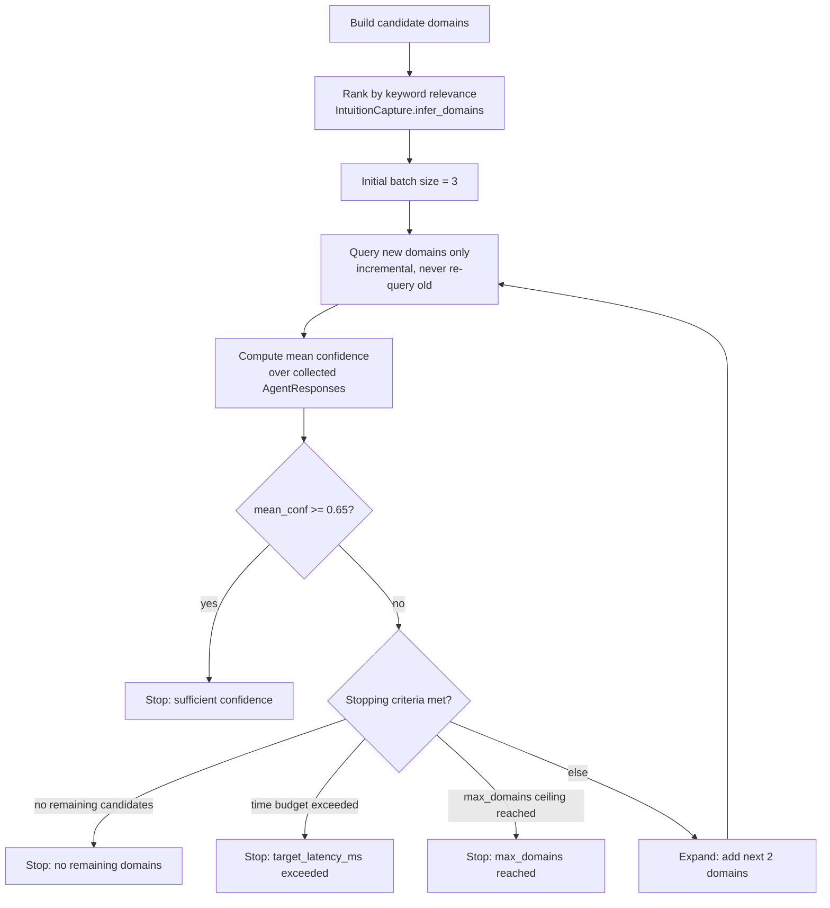

```mermaid
flowchart TD
  START[Build candidate domains] --> RANK[Rank by keyword relevance\nIntuitionCapture.infer_domains]
  RANK --> INIT[Initial batch size = 3]
  INIT --> QUERY[Query new domains only\nincremental, never re-query old]
  QUERY --> MEAN[Compute mean confidence\nover collected AgentResponses]

  MEAN --> STOP{mean_conf >= 0.65?}
  STOP -->|yes| DONE[Stop: sufficient confidence]
  STOP -->|no| CHECK{Stopping criteria met?}

  CHECK -->|no remaining candidates| DONE2[Stop: no remaining domains]
  CHECK -->|time budget exceeded| DONE3[Stop: target_latency_ms exceeded]
  CHECK -->|max_domains ceiling reached| DONE4[Stop: max_domains reached]
  CHECK -->|else| EXPAND[Expand: add next 2 domains]
  EXPAND --> QUERY
```
