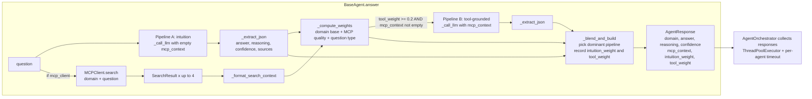

```mermaid
flowchart LR
  subgraph AG[BaseAgent.answer]
    Q[question] --> A1[Pipeline A: intuition\n_call_llm with empty mcp_context]
    A1 --> AJ[_extract_json\nanswer, reasoning, confidence, sources]

    Q -->|if mcp_client| S[MCPClient.search\ndomain + question]
    S --> SR[SearchResult x up to 4]
    SR --> CTX[_format_search_context]

    AJ --> W[_compute_weights\ndomain base + MCP quality + question type]
    CTX --> W

    W -->|tool_weight >= 0.2 AND mcp_context not empty| B1[Pipeline B: tool-grounded\n_call_llm with mcp_context]
    B1 --> BJ[_extract_json]

    W --> BLEND[_blend_and_build\npick dominant pipeline\nrecord intuition_weight and tool_weight]
    AJ --> BLEND
    BJ --> BLEND

    BLEND --> RESP[AgentResponse\ndomain, answer, reasoning, confidence\nmcp_context, intuition_weight, tool_weight]
  end

  RESP --> ORCH[AgentOrchestrator collects responses\nThreadPoolExecutor + per-agent timeout]
```
