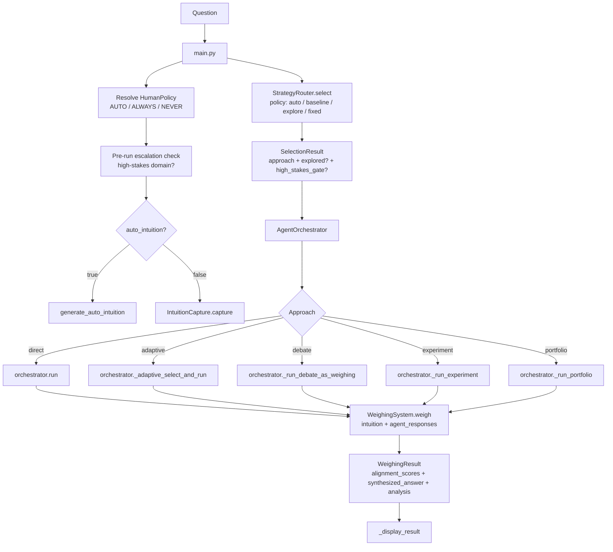

```mermaid
flowchart TD
  Q[Question] --> CLI[main.py]
  CLI --> POLICY[Resolve HumanPolicy\nAUTO / ALWAYS / NEVER]
  POLICY --> PRECHECK[Pre-run escalation check\nhigh-stakes domain?]
  PRECHECK --> MODE{auto_intuition?}
  MODE -- true --> AI[generate_auto_intuition]
  MODE -- false --> IC[IntuitionCapture.capture]

  CLI --> ROUTER[StrategyRouter.select\npolicy: auto / baseline / explore / fixed]
  ROUTER --> SEL[SelectionResult\napproach + explored? + high_stakes_gate?]

  SEL --> ORCH[AgentOrchestrator]
  ORCH --> DISPATCH{Approach}
  DISPATCH -->|direct| RUN[orchestrator.run]
  DISPATCH -->|adaptive| RUNA[orchestrator._adaptive_select_and_run]
  DISPATCH -->|debate| RUNB[orchestrator._run_debate_as_weighing]
  DISPATCH -->|experiment| RUNE[orchestrator._run_experiment]
  DISPATCH -->|portfolio| RUNP[orchestrator._run_portfolio]

  RUN --> WS[WeighingSystem.weigh\nintuition + agent_responses]
  RUNA --> WS
  RUNB --> WS
  RUNE --> WS
  RUNP --> WS

  WS --> OUT[WeighingResult\nalignment_scores + synthesized_answer + analysis]
  OUT --> PRINT[_display_result]
```
