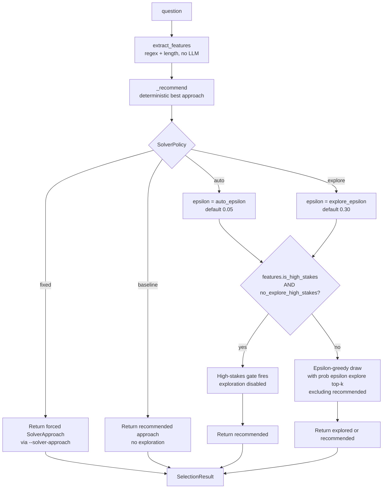

```mermaid
flowchart TD
  START[question] --> FEAT[extract_features\nregex + length, no LLM]
  FEAT --> REC[_recommend\ndeterministic best approach]
  REC --> POL{SolverPolicy}

  POL -->|fixed| FIX[Return forced SolverApproach\nvia --solver-approach]
  POL -->|baseline| BASE[Return recommended approach\nno exploration]
  POL -->|auto| AUTO[epsilon = auto_epsilon\ndefault 0.05]
  POL -->|explore| EXP[epsilon = explore_epsilon\ndefault 0.30]

  AUTO --> HS{features.is_high_stakes\nAND no_explore_high_stakes?}
  EXP --> HS

  HS -->|yes| GATE[High-stakes gate fires\nexploration disabled]
  HS -->|no| DRAW[Epsilon-greedy draw\nwith prob epsilon explore top-k\nexcluding recommended]

  GATE --> PICK[Return recommended]
  DRAW --> PICK2[Return explored or recommended]

  FIX --> OUT[SelectionResult]
  BASE --> OUT
  PICK --> OUT
  PICK2 --> OUT
```
